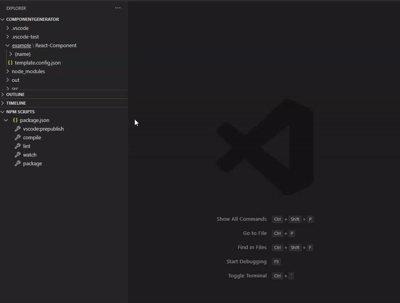

## Features

Automatic template generation in Visual Studio Code based on a pre-defined templates folder, using an extra context menu entry on directories in the Explorer.


### Configuration

In your preferences, set the `templates.path` variable as the path to a directory which will contain all templates.

### Creating a template

Inside the template folder, create a new folder with a recognizable name. This will be the name of this specific template.  
This template folder can contain an optional `template.config.json` file if you intent to make use of parameters.  

#### template.config.json

The contents of this config file are as follows:
```
{
	"parameters": [
		{
			"name": "Name of the parameter",
			"variable": "name_of_the_variable",
			"description": "Description of this variable",
			"pattern": "[a-zA-Z]+"
		},
		...
	]
}
```

* `name`: This is the name of the parameter as it is presented during generation inside Visual Studio Code
* `variable`: This is the name of the variable as it's used in the template.
* `description`: This is the description of the parameter as it is presented during generation inside Visual Studio Code
* `pattern` (optional): An optional RegEx pattern to ensure the user inputs a correct value.

Other than this `template.config.json` file, nothing is required.  
You can add all your own files and (sub-)directories to the template folder and these will all be created when the template is generated in Visual Studio Code.  

#### Usage of parameters
When adding files or contents of files to the template, parameter placeholders can be used.  
These placeholders look like `{variablename}` and will be replaced with the value entered in Visual Studio Code when running the template generation.

### Examples

An example of a template (an overly templified React component) can be found in the `example` folder of this repository.